# Проектирование. Уровень 1

## Архитектура исходного приложения

```mermaid
graph TD
    App[App] --> Header
    App --> Main
    App --> Footer
    App --> ImagePopup
    App --> EditProfilePopup
    App --> EditAvatarPopup
    App --> AddPlacePopup 
    App --> Register
    App --> Login
    
    

    %% Main component interactions
    Main --> Card

    %% Popups that extend PopupWithForm
    EditProfilePopup --> PopupWithForm
    EditAvatarPopup --> PopupWithForm
    AddPlacePopup --> PopupWithForm


    Register -->|onRegister| auth[Auth Utility]
    Login -->|onLogin| auth[Auth Utility]

    Register -->|isInfoToolTipOpen| InfoTooltip
    Login -->|isInfoToolTipOpen| InfoTooltip

    Card --> CurrentUserContext
    Card --> selectedCard



    %% Context Provider
    Main -->|handleCardLike| CurrentUserContext[(currentUser)]

    EditProfilePopup -->|handleUpdateUser| CurrentUserContext[(currentUser)]
    EditAvatarPopup  -->|handleUpdateAvatar| CurrentUserContext[(currentUser)]


    Main -->|handleCardClick| selectedCard[(selectedCard)]
    ImagePopup --> selectedCard[(selectedCard)]
    AddPlacePopup -->|handleAddPlaceSubmit| cards

    Main -->|handleCardDelete| cards[(cards)]
    Main -->|handleCardLike| cards[(cards)]
    Main -->|handleAddPlaceSubmit| cards[(cards)]
    


    cards[(cards)] --> api[api Utility]
    CurrentUserContext[(currentUser)]--> api[api Utility]

    %% Styling classes
    style Main fill:#f9f,stroke:#333,stroke-width:2px    
    style Card fill:#f9f,stroke:#333,stroke-width:2px    
    style AddPlacePopup fill:#f9f,stroke:#333,stroke-width:2px
    style ImagePopup fill:#f9f,stroke:#333,stroke-width:2px
    style selectedCard fill:#f9f,stroke:#333,stroke-width:2px
    style cards fill:#f9f,stroke:#333,stroke-width:2px
    style api fill:#f9f,stroke:#333,stroke-width:2px

    style Register fill:#add8e6,stroke:#333,stroke-width:2px
    style Login fill:#add8e6,stroke:#333,stroke-width:2px
    style InfoTooltip fill:#add8e6,stroke:#333,stroke-width:2px
    style auth fill:#add8e6,stroke:#333,stroke-width:2px

    style Header fill:#90EE90,stroke:#333,stroke-width:2px
    style Footer fill:#90EE90,stroke:#333,stroke-width:2px
    style PopupWithForm fill:#90EE90,stroke:#333,stroke-width:2px

    style CurrentUserContext fill:#FFFFE0,stroke:#333,stroke-width:2px
    style EditProfilePopup fill:#FFFFE0,stroke:#333,stroke-width:2px
    style EditAvatarPopup fill:#FFFFE0,stroke:#333,stroke-width:2px
```

Цветом обозначены кандидаты на группировку в микрофронтенд: Аутентикация, работа с профилем пользователя, работа с карточками и ui общего пользования.
Предпосылки для разделения две:
- Группы сравнительно слабо связаны между собой
- Став микрофронтендами, каждая группа сможет развиваться независимо. Например:
    - В аутентикацию можно будет добавить новые методы (двухфакторную аутентикацию и интеграцию с соц-сетями)
    - В UI общего пользования демонстрацию рекламы
    - Работа с карточками может быть расширена поддержкой комментариев.
    - В профиле может добавляться информация

## Подход к интеграции

Для интеграции микрофронтенов с основным приложением выбран подход 
**Webpack Module Federation**

**Преимущества:**
* **Простота.** Module Federation предоставляет простой способ обмена кодом между микрофронтендами. Это упрощает разработку и тестирование, а также снижает риск ошибок.
* **Эффективность.** Module Federation может ускорить разработку и развёртывание приложения, поскольку он позволяет повторно использовать код между микрофронтендами.
* **Интеграция.** Module Federation поддерживает интеграцию с различными фреймворками и библиотеками, что делает его универсальным решением для микрофронтендовой архитектуры.

# Проектирование. Уровень 2

В папке ./frontend/microfrontend созданы папки для микрофронтендов:
- microfrontend-auth      - для аутентикации
- microfrontend-cards     - для работы с карточками
- microfrontend-common-ui - для общего UI
- microfrontend-profile   - для работы с профилем пользователя

В модуле api.js была функция getAppInfo, её нужно будет реализовать на уровне апликейшена в виде двух вызовов к микрофронтендам microfrontend-profile и microfrontend-cards.

## Задание 2.

Бэкенд разделён на три части.
- Система работы с пользователями
- AuctionFlow: Система товаров, услуг, аукционов и заказов
- Система платежей

Каждая из систем имеет собственную базу данных.

Разделение на части основано на функциональности модулей, различием требований к ним и возможной разной скоростью будущей разработки.

Например, Платёжная система имеет повышенные требования к безопасности и надёжности. Кромет того, она потребует интеграции с новыми платёжными сервисами.

Система AuctionFlow это ядро всей системы, она потребует активной оптимизации производительности.

Система работы с пользователями потребует интеграции с внешними аутентикационными системами.

Диаграмму с декомпозицией можно найти здесь: https://drive.google.com/file/d/1diMTrcJmOXui-OoW7vEJzWzYtQBFZbmh/view?usp=sharing
